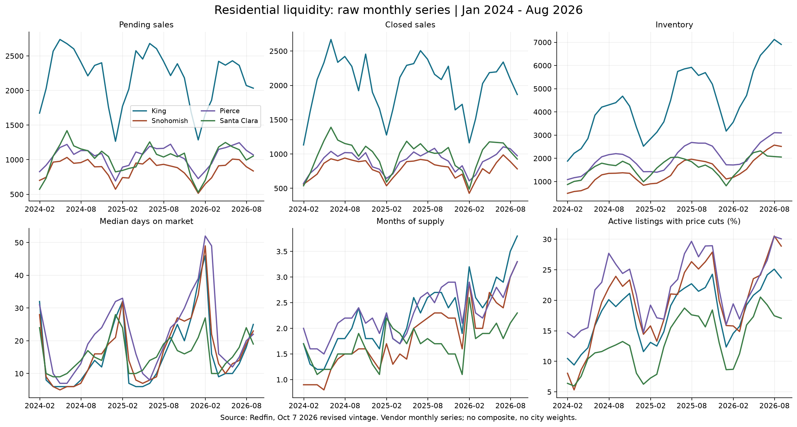
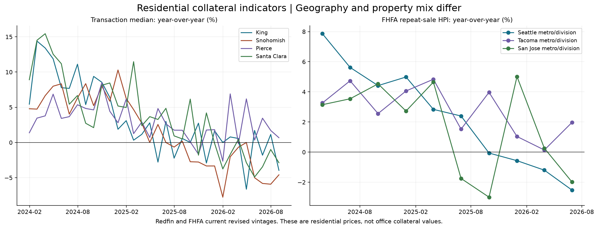
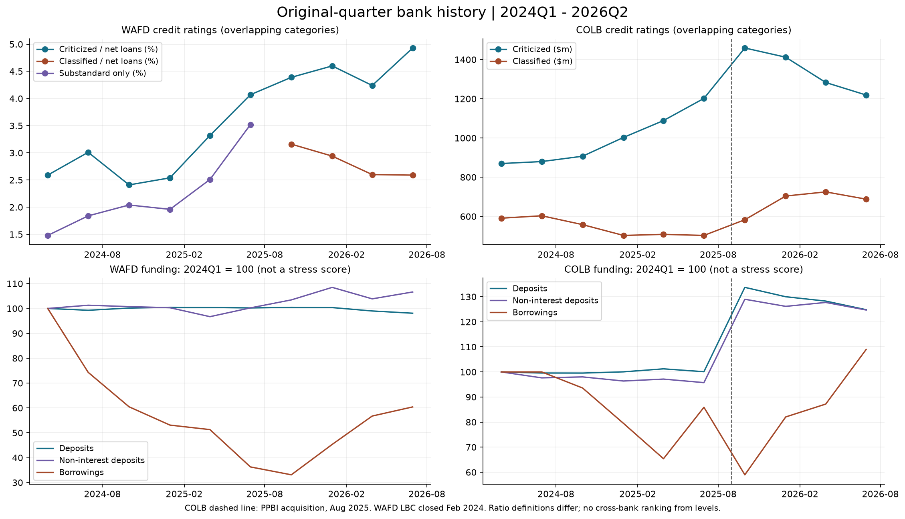
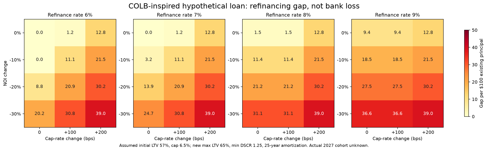
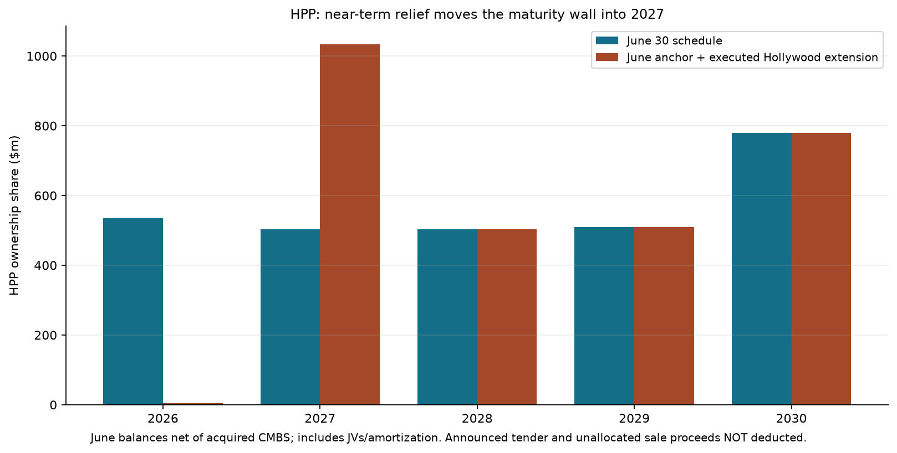

# 下一阶段实证结果：成交压力、信用阶段与 2027 rollover

信息截止：**2026-10-07（美国太平洋时间）**。银行财务截至 2026Q2；Redfin 月度截至 8 月、NWMLS King 截至 9 月、FHFA 截至 Q2；市场复盘沿用已核对的截至 10 月 6 日完整交易日数据。原始文件检索跨 UTC 10 月 8 日，仍是本地 10 月 7 日。

## 先回答研究问题

**已经能确认：Puget 的住宅成交与退出流动性明显转弱，价格压力已出现但高度分化；COLB 存在有意义的再融资补资情景，尚不能据此确认银行将在 2027 年承担多少信用损失；HPP 的已知 2027 到期压力则比单看 6 月报表更集中。市场是否已经充分反映这些风险，目前仍不能识别。**

- **HPP：优先研究业主融资与租约兑现风险。** Hollywood 展期解除眼前的到期压力，同时将 HPP 份额净额约 $530.8m 移入 2027 年。6 月余额加已执行事件后，2027 maturity/amortization 从约 $503.2m 变为 **$1,034.0m**。这是已知事件桥接值，尚非 10 月实际资产负债表。
- **COLB：优先研究 2027 office cohort 的再融资补资，而非宣称全行坏账正在直线上升。** 在下文基准假设下，NOI -10%、cap rate +100bp、再融资利率 7% 对应每 $100 本金约 **$11.1** 缺口；NOI -20% 时约 **$20.9**。缺口可以通过借款人补资、出售、展期等方式解决，不能等同银行损失。
- **WAFD：继续归入资金结构与并购重估主线。** 2025Q3 至 2026Q2 借款（含次级债）增长约 **82.5%**，存款下降；但 NIM、PPNR 改善，classified 未继续上升。9 月跑输不能全部解释成地产信用恶化。
- **KRC：保留反证/业务比较定位。** 原 Q2 租赁和 2027 ABR 证据没有因本轮而改变，尚不与 HPP 等量投入。以上是研究优先级，不是已经识别出的预期交易收益排序。

## 1. 房地产：流动性与抵押物价格分开看

### 六县、32 个月的原始序列

不使用人工城市权重或阈值，不造 composite score。King、Snohomish、Pierce、Santa Clara、San Francisco、San Mateo 均已入表；San Jose 另有 FHFA metro repeat-sale 序列。县与 metro/MSAD 的边界保留，不互相替代。

下表是 **2026 年 8 月 Redfin 当前修订版本**，不是 9 月投资者当时已看到的历史快照。变动为供应商报告的同比百分比，sale/list 为百分比水平。

| 地区 | Pending YoY % | Closed YoY % | 库存 YoY % | DOM 天 | 供应月数 | 中位价 YoY % | Sale/List % |
| --- | --- | --- | --- | --- | --- | --- | --- |
| King County, WA | -8.21 | -13.60 | 23.94 | 25.00 | 3.80 | -3.95 | 98.58 |
| Pierce County, WA | -12.58 | -10.06 | 16.65 | 22.00 | 3.30 | 0.68 | 99.91 |
| San Francisco County, CA | 1.67 | 5.03 | -17.67 | 18.00 | 2.00 | 17.08 | 112.85 |
| San Mateo County, CA | -9.44 | 5.63 | -8.06 | 15.00 | 1.60 | 1.29 | 104.68 |
| Santa Clara County, CA | -3.04 | -8.32 | 27.23 | 19.00 | 2.30 | -2.87 | 102.00 |
| Snohomish County, WA | -7.92 | -7.12 | 31.71 | 23.00 | 3.30 | -4.59 | 99.51 |

**King 不是只有量跌价不动：** 8 月成交中位价同比 -3.95%，$/sf -6.76%；但下面 NWMLS 9 月总体中位价持平。供应商、季节调整、样本和月份不同，不能拼成“8 月跌、9 月立刻反弹”的同一条曲线。

**Santa Clara / San Jose 已明确纳入：** Santa Clara 8 月库存 +27.23%，成交 -8.32%，中位价 -2.87%；San Jose-Sunnyvale-Santa Clara 的 FHFA Q2 repeat-sale HPI 同比约 -1.99%。不能继续将 South Bay 缺失理解成低风险。

**反证也保留：** San Francisco 县 8 月成交与中位价同比上升、库存下降。交易中位数受成交结构影响；它与 FHFA 更广地理、不同季度的重复销售指数不是同一测量。住宅并未出现全湾区同步崩塌。

### 9 月 King County：NWMLS 独立交叉检查

| 物业类型 | Active YoY % | Pending YoY % | Closed YoY % | 中位价 $ | 价格 YoY % | 供应月数 |
| --- | --- | --- | --- | --- | --- | --- |
| residential_and_condo | 31.11 | -16.69 | -12.19 | 850,000.00 | 0.00 | 4.70 |
| residential | 35.95 | -14.28 | -8.47 | 949,975.00 | -0.73 | 4.10 |
| condo | 21.39 | -25.23 | -24.14 | 496,000.00 | -5.97 | 7.05 |

总体挂牌库存 +31.11%、pending -16.69%、成交 -12.19%，供应 4.70 个月；公寓供应 7.05 个月，成交 -24.14%、价格 -5.97%。**最弱的可见环节是退出流动性，公寓价格也已转弱；独栋与公寓不能合并成一个“房价崩溃”判断。**

来源：[Redfin 下载中心](https://www.redfin.com/news/data-center/downloads/)、[季节调整与修订方法](https://www.redfin.com/news/data-center/methodology/)、[NWMLS King 原表](https://www.nwmls.com/wp-content/uploads/2026/10/Breakouts_King.pdf)、[FHFA purchase-only metro 数据](https://www.fhfa.gov/hpi/download/quarterly_datasets/hpi_po_metro.txt)。Redfin 保留原厂月度序列，中位成交价明确 NSA；没有自行季调。FHFA 为住宅重复销售指标。

**范围限制：这些是住宅，不是 office 估价或 NOI。** CBRE Q2 Puget 和 SF 正净吸纳的反证继续有效；高空置与局部租赁修复可以共存。county recorder/deed records 尚未另行接入，NWMLS closed sales 不能冒充县交易登记簿。

## 2. 信用目前处在哪个阶段

已从 **40 份目标文档**提取 **538 个银行季度观测**，覆盖 2024Q1–2026Q2 十个日历季度。COLB rating 合计逐季与原报告贷款摊余成本 grand total 对账；万元/千元/百万元单位切换按原表读取。完整数字和出处见 [原始季度长表](core_history_long.csv)、[信用评级对账](core_rating_reconciliation.json)。

### WAFD

金额单位 $m；criticized、classified、substandard 为各自披露的净贷款百分比，类别可能重叠。

| 季度 | Criticized % | Classified % | Substandard % | Nonaccrual | NCO 季度 | Provision 季度 | PPNR 季度 |
| --- | --- | --- | --- | --- | --- | --- | --- |
| 2024-03-31 | 2.59 | — | 1.48 | 60.81 | 0.15 | 16.00 | 36.96 |
| 2024-06-30 | 3.01 | — | 1.84 | 61.27 | 1.25 | 1.50 | 84.24 |
| 2024-09-30 | 2.41 | — | 2.04 | 69.54 | 0.07 | 0.00 | 80.67 |
| 2024-12-31 | 2.54 | — | 1.96 | 72.49 | 0.23 | 0.00 | 60.25 |
| 2025-03-31 | 3.32 | — | 2.51 | 59.89 | 5.06 | 2.75 | 74.76 |
| 2025-06-30 | 4.07 | — | 3.52 | 82.70 | 5.44 | 2.00 | 81.76 |
| 2025-09-30 | 4.39 | 3.16 | — | 128.63 | 1.05 | 3.00 | 80.62 |
| 2025-12-31 | 4.60 | 2.94 | — | 191.35 | 3.68 | 3.50 | 85.80 |
| 2026-03-31 | 4.24 | 2.60 | — | 123.86 | 0.59 | 4.00 | 87.81 |
| 2026-06-30 | 4.93 | 2.59 | — | 127.57 | 1.62 | 11.00 | 95.35 |

2026Q2 criticized 4.24%→4.93%，classified 2.60%→2.59%；nonaccrual $123.9m→$127.6m，仍低于 2025Q4 的 $191.3m。Q2 provision 从 $4m 升至 $11m，需要跟进，但 PPNR 从 $87.8m 升至 $95.3m。**目前是早期风险评级与资金结构压力并存，未出现所有信用阶段同步恶化。**

WAFD 2024Q1–2025Q2 原 earnings release 只给 substandard，不能直接改名为 adversely classified。后者原始同季披露在本轮只有最近四季；早期字段留空、列入缺口。重新获取早期 SEC 申报仍返回 403。十季其它核心序列已具备，不能把这一处缺值藏成零，也不因此推迟 RefiGap。

### COLB

金额单位 $m。全行 criticized = special mention + substandard + doubtful + loss；classified = 后三项。口径为贷款摊余成本，不是 gross balance，也非纯 commercial portfolio；含部分政府担保贷款。其水平不能直接与 WAFD 净贷款比率比较。

| 季度 | Criticized | Classified | Nonaccrual | 90+仍计息 | NCO 季度 | Provision 季度 | PPNR 季度 |
| --- | --- | --- | --- | --- | --- | --- | --- |
| 2024-03-31 | 869.67 | 590.85 | 98.70 | 43.34 | 44.00 | 17.14 | 186.20 |
| 2024-06-30 | 879.74 | 603.30 | 92.57 | 60.52 | 30.43 | 31.82 | 192.91 |
| 2024-09-30 | 906.98 | 558.03 | 98.80 | 66.43 | 29.11 | 28.77 | 225.02 |
| 2024-12-31 | 1,002.75 | 503.00 | 96.48 | 70.42 | 25.66 | 28.20 | 220.54 |
| 2025-03-31 | 1,088.79 | 508.33 | 122.40 | 52.75 | 29.32 | 27.40 | 151.25 |
| 2025-06-30 | 1,201.90 | 503.05 | 97.55 | 79.89 | 29.34 | 29.45 | 232.91 |
| 2025-09-30 | 1,459.00 | 583.00 | 120.00 | 76.00 | 22.00 | 70.00 | 189.00 |
| 2025-12-31 | 1,412.00 | 704.00 | 116.00 | 82.00 | 30.00 | 23.00 | 305.00 |
| 2026-03-31 | 1,283.00 | 725.00 | 187.00 | 74.00 | 35.00 | 28.00 | 283.00 |
| 2026-06-30 | 1,219.00 | 688.00 | 180.00 | 88.00 | 30.00 | 27.00 | 302.00 |

Q2 全行 criticized $1,283m→$1,219m、classified $725m→$688m，均下降；nonaccrual $187m→$180m，也下降。但相较 2025Q4 的 $116m，nonaccrual 仍明显偏高；NPL 从 $198m 到 $268m。**信用压力已经发生过，最新一季又有改善，不能叫作“信用尚未恶化”，也不能写成持续单向恶化。**

2025-08-31 PPBI 并购造成存量规模和组合断点，2025Q3 利润表只包含收购后部分季度；跨并购的金额变化不全是有机信用迁移。WAFD LBC 于 2024-02-29 交割，2024Q1 PPNR 受并购费用等影响。

### COLB office 单独看

| 季度 | Special mention $m | Classified $m | Nonaccrual $m | 30–89逾期 $m | 全office LTV % | 非自用 DSCR |
| --- | --- | --- | --- | --- | --- | --- |
| 2024-03-31 | 22.10 | 60.10 | 13.30 | 0.50 | 56.00 | 1.70 |
| 2024-06-30 | 11.10 | 60.80 | 11.40 | 0.90 | 57.00 | 1.78 |
| 2024-09-30 | 12.60 | 94.10 | 11.40 | 0.00 | 57.00 | 1.80 |
| 2024-12-31 | 45.60 | 66.60 | 10.30 | 19.30 | 57.00 | 1.80 |
| 2025-03-31 | 58.80 | 82.20 | 10.00 | 19.20 | 57.00 | 1.81 |
| 2025-06-30 | 63.80 | 90.00 | 10.00 | 19.10 | 57.00 | 1.83 |
| 2025-09-30 | 47.70 | 85.30 | 21.90 | 6.70 | 59.00 | 1.80 |
| 2025-12-31 | 46.10 | 90.80 | 15.10 | 2.20 | 57.00 | 1.80 |
| 2026-03-31 | 51.20 | 78.30 | 30.20 | 2.70 | 57.00 | 1.78 |
| 2026-06-30 | 45.40 | 85.30 | 29.90 | 7.30 | 57.00 | 1.76 |

2026Q2 office classified $78.3m→$85.3m、30–89 天逾期 $2.7m→$7.3m，是需继续追踪的信号。但 classified 曾在 2024Q3 达 $94.1m；当前值不是十季新高。Nonaccrual $29.9m 与上季 $30.2m 接近，高于 2024 年水平。缺少贷款级迁移，不能把这些重叠余额当作每笔贷款的 Markov 状态转换。

### Funding 同优先级

| 银行 | 季度 | 存款 $m | NIB $m | WAFD借款含次债 $m | COLB借款不含次债 $m | GAAP NIM % | TE NIM % |
| --- | --- | --- | --- | --- | --- | --- | --- |
| COLB | 2024-03-31 | 41,706.16 | 13,808.55 | — | 3,900.00 | — | 3.52 |
| COLB | 2024-06-30 | 41,523.27 | 13,481.62 | — | 3,900.00 | — | 3.56 |
| COLB | 2024-09-30 | 41,514.69 | 13,534.07 | — | 3,650.00 | — | 3.56 |
| COLB | 2024-12-31 | 41,720.73 | 13,307.91 | — | 3,100.00 | — | 3.64 |
| COLB | 2025-03-31 | 42,217.69 | 13,413.93 | — | 2,550.00 | — | 3.60 |
| COLB | 2025-06-30 | 41,742.66 | 13,219.63 | — | 3,350.00 | — | 3.75 |
| COLB | 2025-09-30 | 55,771.00 | 17,810.00 | — | 2,300.00 | — | 3.84 |
| COLB | 2025-12-31 | 54,211.00 | 17,419.00 | — | 3,200.00 | — | 4.06 |
| COLB | 2026-03-31 | 53,489.00 | 17,635.00 | — | 3,400.00 | — | 3.96 |
| COLB | 2026-06-30 | 52,056.00 | 17,218.00 | — | 4,250.00 | — | 3.93 |
| WAFD | 2024-03-31 | 21,339.77 | 2,482.01 | 5,489.50 | — | 2.73 | — |
| WAFD | 2024-06-30 | 21,184.76 | 2,514.31 | 4,079.36 | — | 2.56 | — |
| WAFD | 2024-09-30 | 21,373.97 | 2,500.47 | 3,318.31 | — | 2.62 | — |
| WAFD | 2024-12-31 | 21,438.78 | 2,489.39 | 2,914.63 | — | 2.39 | — |
| WAFD | 2025-03-31 | 21,427.43 | 2,400.17 | 2,814.94 | — | 2.55 | — |
| WAFD | 2025-06-30 | 21,386.57 | 2,487.82 | 1,991.09 | — | 2.69 | — |
| WAFD | 2025-09-30 | 21,437.64 | 2,567.54 | 1,817.25 | — | 2.71 | — |
| WAFD | 2025-12-31 | 21,416.97 | 2,692.68 | 2,488.41 | — | 2.70 | — |
| WAFD | 2026-03-31 | 21,124.15 | 2,577.98 | 3,114.55 | — | 2.81 | — |
| WAFD | 2026-06-30 | 20,932.08 | 2,646.61 | 3,315.70 | — | 2.81 | — |

COLB brokered deposits 从 2025Q4 $2,355m 降至 Q2 $978m，同时 borrowings 升至 $4,250m。10-Q 明确包括以 FHLB 替代部分 brokered funding；不能只看存款减少就判断发生存款挤兑。WAFD 的 uninsured **且** uncollateralized 与 COLB uninsured total 保持不同指标。

原始季度来源见 [40 份来源清单](core_source_manifest.json)；[COLB 官方 SEC 申报目录](https://www.columbiabankingsystem.com/sec-filings/sec-filings/default.aspx)已核对 filing dates，特别是 2025Q3：签署日 11 月 5 日、披露日 **11 月 6 日**。日期只有日精度时沿用次日 12:00 UTC 的保守可用时间。

## 3. COLB 2027：什么情景开始需要补资

[Q2 presentation](https://s26.q4cdn.com/577104185/files/doc_earnings/2026/q2/presentation/COLB-Q2-2026-Earnings-Presentation-FINAL.pdf)第 26 页披露全 office 平均 LTV 57%、非自用 office DSCR 1.76、2027 到期占比 9%。**这些并非同一批 2027 贷款的联合特征。** 不将 9% 乘以范围未核对的 10-Q $3.559bn，也不据此给出美元损失额。

模型用每 $100 现有本金描述一笔假想贷款：

- 初始估值 `V0 = 100 / 0.57`；初始 `NOI0 = V0 × 假设 cap rate`。
- 压力后 `V = NOI / cap rate`；再融资额度 = `min(最高LTV × V, NOI / (最低DSCR × 新债年还款系数))`。
- `RefiGap = max(0, 100 - 再融资额度)`。25 年摊还使用月供年化；同时跑 interest-only 敏感性。
- 1.76 DSCR 只是另一组披露参考，不用它推断该到期 cohort 的真实利率或 NOI。没有摊还前本金变化和交易费；这是给定假设下的补资情景，非实际缺口的上下界。

共 **576 格**：初始 cap rate 5.5%/6.5%/7.5%，NOI 0/-10/-20/-30%，cap +0/+100/+200bp，新利率 6%/7%/8%/9%，最高 LTV 60%/65%，25 年摊还/IO，最低 DSCR 1.25。cap、承贷约束和新利率都是版本化研究假设，尚不是今天某家银行给该 cohort 的融资报价。

在初始 cap 6.5%、新利率 7%、最高 LTV 65%、最低 DSCR 1.25、25 年摊还条件下：

| NOI变动（小数） | Cap变动 bp | 每$100本金补资 | 限制条件 |
| --- | --- | --- | --- |
| 0.00 | 0.00 | 0.00 | DSCR |
| 0.00 | 100.00 | 1.17 | LTV |
| 0.00 | 200.00 | 12.80 | LTV |
| -0.10 | 0.00 | 3.19 | DSCR |
| -0.10 | 100.00 | 11.05 | LTV |
| -0.10 | 200.00 | 21.52 | LTV |
| -0.20 | 0.00 | 13.95 | DSCR |
| -0.20 | 100.00 | 20.94 | LTV |
| -0.20 | 200.00 | 30.24 | LTV |
| -0.30 | 0.00 | 24.71 | DSCR |
| -0.30 | 100.00 | 30.82 | LTV |
| -0.30 | 200.00 | 38.96 | LTV |

- Cap 不变时，NOI 降幅超过约 **7.0%** 开始触发 DSCR 缺口；若改为只付息，该临界点不同。
- NOI 不变时，cap 上升约 **91bp** 就触及 65% LTV 限额；+100bp 已有约 1.2% 缺口。
- 对初始 cap 假设敏感：同为 NOI -10%、cap +100bp、新利率 7%、25 年摊还、65% LTV，结果如下。

| 初始cap % | 每$100本金补资 | 限制条件 |
| --- | --- | --- |
| 5.50 | 18.09 | DSCR |
| 6.50 | 11.05 | LTV |
| 7.50 | 9.44 | LTV |

**结论：57% 的平均 LTV 不能排除 refinance shortfall；但是否变成银行损失仍取决于 2027 cohort 的实际估值基准、贷款条款、借款人补资能力及回收。** 平均 LTV 还可能基于旧估值，不能冒充今天市值。完整假设见 [配置](../../config/colb_refi_assumptions.json)，全部结果见 [网格](colb_refi_grid.csv)。

## 4. HPP：当前已知事件如何改写 2027

口径：**HPP 持有份额，含非并表 JV，扣已收购 Hollywood CMBS 债权，并含计划摊还**。不是 GAAP consolidated debt，也不是整笔 JV 的法定本金。整笔 Hollywood JV 的 $1.1bn 再融资义务仍单独存在。

| 年份 | 6月到期/摊还 $m | 已执行展期移入/出 $m | 6月基线加已知事件 $m |
| --- | --- | --- | --- |
| 2,026.00 | 535.77 | -530.77 | 5.00 |
| 2,027.00 | 503.19 | 530.77 | 1,033.96 |
| 2,028.00 | 503.25 | 0.00 | 503.25 |
| 2,029.00 | 510.00 | 0.00 | 510.00 |
| 2,030.00 | 778.83 | 0.00 | 778.83 |

- **已执行展期：** $1.1bn × 51% − $30.233m 已收购债权 = $530.767m，从 2026 移至 2027。没有本金偿还；JV 配置 $20m leasing reserve、过剩现金流 sweep，并不等于释放同额自由现金。[9 月 11 日公告](https://s22.q4cdn.com/675150095/files/content_files/HMP-Loan-Extension-PR-091026-FINAL.pdf)
- **已完成出售：** 875/899 Howard 售价 $65.5m，Q3 总出售 $90.5m，均为税费/调整前。公告用途为 general corporate purposes，没有逐笔已完成债务偿还可扣；现金与净债务桥接仍缺实际结算信息。[9 月 25 日公告](https://s22.q4cdn.com/675150095/files/doc_news/2026/875-and-899-Howard-Sale-PR-092426-FINAL-003.pdf)
- **尚未完成 tender：** 10 月 5 日公告、9 日到期、预计 14 日结算。截至本报告完成扣减 **$0**。如果两档各买回目标 $100m，购买现金约 $197.125m（未计应计利息/费用）；可能使用 revolver，所以不能自动说净债务减少 $200m。实际分配仍可能不同。[Tender 条款](https://s22.q4cdn.com/675150095/files/doc_news/2026/10/HPP-Tender-PR-FINAL.pdf)
- **额度与债务分开：** 6 月 revolver 未提款、可用约 $795.3m；其中 $333.3m commitment 在 2026 年 12 月到期。额度到期影响融资灵活性，不是当天应还的 $333.3m 贷款本金。

**租约桥接也已启动：** 6 月披露 2027 到期租约的“当前 ABR”为 $66.100m（13.9%）；其中已出售 875 Howard 的 Glu Mobile 租约 ABR $5.638m、2027-11-30 到期，能够同口径扣除。扣已明确识别的这一笔后为 **$60.462m**。出处为 [Q2 supplement](https://s22.q4cdn.com/675150095/files/doc_financials/2026/q2/HPP-Q2-2026-Supplemental-compressed.pdf)第 19 页租户 ABR、第 22 页 2027 汇总、第 24 页 Glu→875 Howard 映射。

这个 $60.462m **不是完整的当前 2027 lease roll**：其它已售物业的逐租约信息、后续续租/终止/新租尚未完整对账。也不混用 $67.336m 的“到期时 ABR”。Redfin/Salesforce 多地点、多到期年的合计 ABR 不按面积强行分摊。

**HPP 现在最清楚的风险：短期融资获得缓冲，但 2027 债务与租约再定价重叠；资产出售也确实移除了部分空置/重租风险。** 6 月 North San Jose 59.9%、Seattle 74.7% 入住率只作历史基线，出售后的当前分区入住率尚未重算。债务桥不把“展期”写成“风险消失”，租约桥也不忽略已卖掉的风险。

## 5. 四层表与已经 price-in 的部分

| 层 | WAFD | COLB |
| --- | --- | --- |
| 当前已发生 | 存款下降、借款增加；PPNR/NIM 改善；criticized 上升但 classified 基本持平 | Q2 全行 criticized/classified 下降；nonaccrual 较去年底高；brokered funding 下降、借款上升 |
| 领先恶化指标 | criticized Q2 4.93%；融资结构变化与并购条款 | office classified/30–89逾期回升，非自用 DSCR 1.76；全行评级改善作为反证 |
| 尚未发生但暴露存在 | 未来资产/资金重定价与并购执行结果；不能指定所有贷款在2027转坏 | 2027 office maturity 9%；给定 NOI/cap/rate 的补资缺口情景，未观察实际cohort损失 |
| 市场已经反映的价格变化 | 9月总回报 -16.30%，较KRE -11.24pp；10月6日价格/6月TBV约0.97x | 9月总回报 -3.51%，较KRE +1.55pp；同口径P/TBV约1.50x |

最后一行是价格变化/估值事实，**不是市场已计入多少未来损失的估计**。相对跑赢或更高 P/TBV 也不能单独证明未定价。

已补 KRE-only、KRE+2Y/10Y、旧 KRE+SPY+2Y/10Y 三个可运行规格；同为事前 252 交易日训练、2026-09-08 至 9 月底，累计日残差范围：

| 银行 | 最小残差 pp | 最大残差 pp |
| --- | --- | --- |
| COLB | 0.76 | 1.72 |
| WAFD | -12.94 | -11.95 |

126 日训练及单日/三日结果也保存在 [规格敏感性](event_specification_sensitivity.json)。这些残差是每日简单残差之和，不是复合超额收益；iid 区间只是描述性估计。

**matched peer basket+rates 仍未计算**，因为尚无完成匹配、剔除目标公司的篮子。当前 range 是可用规格的范围，不冒充三个指定基准都完成。KRE 也可能持有目标公司，机械压低残差的限制保留。旧规格原始 condition number 约 147，但含单位尺度影响；标准化后约 3.33，不能只凭原始数值诊断共线性。

## 可交付状态与紧接着的研究

本轮已经实际运行：十季目标历史、六县住宅双向量与 FHFA/NWMLS 交叉检查、576 格 COLB RefiGap、HPP 已知事件 debt/lease bridge、事件规格敏感性及五张可导出图。**没有把全历史文件验收、对照组匹配、LODES/HMDA/CMBS 解析当作本轮前置条件。**

尚未闭合的重点是数据而非架构：

1. COLB 2027 office cohort 的 LTV/NOI/DSCR 联合特征与估值日期、借款人可补资金；当前只能给情景边界，不能给银行损失额。
2. HPP tender 的实际接受额、结算及资金来源；其它出售物业的 lease roll 与真实当前净债务。下一次披露后更新桥接。
3. WAFD 早期 classified 的原始申报、尚缺的完整 funding/loan floor 字段；现有分类缺口清楚保留。
4. 有了历史面板后再做低科技暴露控制组匹配、更多季度/地区与领先关系检验。当前样本短、有并购断点、住宅与全行贷款权重不明，因此不发布一个看似精确的领先相关系数。

**对最初投资问题的回答：目前已证实的是成交压力与部分价格/信用压力，并识别到 2027 再融资脆弱条件；尚未证实“未定价的 2027 信用损失”。HPP 的到期集中最具体，COLB 的 cohort 值得下一步验证，WAFD 则要继续沿资金与并购线解释。**

### 复现

`python scripts/core_path.py` 从本地原始缓存重跑；`python scripts/core_path.py --from-panels` 在另一台电脑从 Git 中的提取面板重跑情景、事件、图及报告。后者不重新校验被忽略的原始 PDF/CSV，原观测血缘保持原执行版本。Redfin 原始下载从下载页按 `Monthly / All Counties / Jan 2024–Aug 2026` 两组（Housing Market 全指标、Price Drops）取得，原字节 SHA 保存在对应 source JSON；数据更新会改变哈希，不应覆盖旧 vintage。

完整下载与已生成结果清单见 [HANDOFF](../../HANDOFF.md)。运行证据：[core_run_manifest](core_run_manifest.json)、[代码树版本](core_code_manifest.json)、[银行原观测](core_history_observations.json)、[HPP桥接](hpp_current_bridge.json)、[COLB情景](colb_refi_run.json)。本次执行版本：`aef4a56a6829d5420685a4d498058e83ccc08e12+tree.4e67479291c8900b`。
